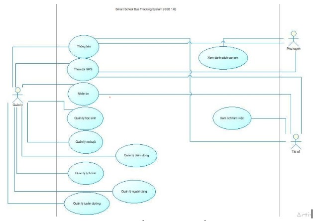

<!-- author: uncletientrung -->
- [Giới thiệu đề tài](#đề-tài-hệ-thống-theo-dõi-xe-buýt)
- [Thành viên & Đóng góp](#thành-viên--đóng-góp)
- [Cài đặt & Chạy chương trình](#getting-started)
- [Use Case tổng quan](#usecase-tổng-quan-hệ-thông)
- [Tài khoản Admin](#tài-khoản-admin)
- [Giao diện hệ thống](#giao-diện)

# Đồ án môn Công nghệ phần mềm  
## Đề tài: Hệ thống theo dõi xe buýt 

## Thành viên & Đóng góp
| Thành viên | MSSV | Vai trò | Frontend | Backend | 
|----|------|--------|----------|----------|
|  Nguyễn Tiến Trung | 3123410396 | Nhóm trưởng | 20% | 70% |
|  Nguyễn Minh Thuận | 3123410365 | Thành viên | 10% | 10% |
|  Nguyễn Thái Vinh | 3123410433 | Thành viên | 60% | 10% |
|  Phan Hoàng Vũ | 3123410436 | Thành viên | 10% | 10% |
|  Đặng Nhật Đức | 3123410082 | Thành viên | 0% | 0% |

**Lưu ý**: Nhóm thực hiện khoảng **30% khối lượng công việc ở Frontend**, 
có tham khảo và sử dụng **công cụ AI hỗ trợ** trong việc tra cứu tài liệu, gợi ý giải pháp và chỉnh sửa nội dung.

## Công nghệ sử dụng
- Frontend: React
  - Thư viện: Leaflet.js
  - API: OSRM (Routing)
- Backend: Node.js, Express, Socket.IO
- Database: MySQL
- Testing: Postman
- Công cụ: XAMPP, Visual Studio Code

## Getting Started
1. Yêu cầu môi trường
    - Node.js
    - XAMPP
    - Visual Studio Code
2. Tải source code về:
    ```bash
   git clone https://github.com/uncletientrung/BusTrackingSystem_CNPM.git
   ```
3. Mở xampp và vào trang http://localhost/phpmyadmin/ tạo 1 database mới có tên là bustrackingsystem và import cơ sở dữ liệu trong folder frontend -> database -> file bustrackingsystem.sql trong source code.
4. Chạy chương trình:
   - Terminal 1:
     ```bash
     cd frontend
     npm install
     npm run dev
     ```
   - Terminal 2:
     ```bash
     cd backend
     npm start
     ```
5. Truy cập "http://localhost:5173/" để sử dụng chương trình

### Usecase tổng quan hệ thông
<table align="center" border="5" cellpadding="10" cellspacing="0">
  <tr>
    <td>
      
    </td>
  </tr>
</table>

### Tài khoản Admin
- Username: admin
- Password: 123

### Giao diện
<table align="center" border="5" cellpadding="10" cellspacing="0">
  <tr>
    <td>
      
    </td>
  </tr>
</table>
<h4 align="center">Trang chủ</h4>

<table align="center" border="5" cellpadding="10" cellspacing="0">
  <tr>
    <td>
      
    </td>
  </tr>
</table>
<h4 align="center">Quản lý xe buýt</h4>

<table align="center" border="5" cellpadding="10" cellspacing="0">
  <tr>
    <td>
      
    </td>
  </tr>
</table>
<h4 align="center">Quản lý tuyến đường</h4>

<table align="center" border="5" cellpadding="10" cellspacing="0">
  <tr>
    <td>
      
    </td>
  </tr>
</table>
<h4 align="center">Quản lý điểm dừng</h4>

<table align="center" border="5" cellpadding="10" cellspacing="0">
  <tr>
    <td>
      
    </td>
  </tr>
</table>
<h4 align="center">Quản lý học sinh</h4>

<table align="center" border="5" cellpadding="10" cellspacing="0">
  <tr>
    <td>
      
    </td>
  </tr>
</table>
<h4 align="center">Theo dõi vị trí xe</h4>

<table align="center" border="5" cellpadding="10" cellspacing="0">
  <tr>
    <td>
      
    </td>
  </tr>
</table>
<h4 align="center">Quản lý lịch trình</h4>

<table align="center" border="5" cellpadding="10" cellspacing="0">
  <tr>
    <td>
      
    </td>
  </tr>
</table>
<h4 align="center">Nhắn tin với tài xế</h4>

<table align="center" border="5" cellpadding="10" cellspacing="0">
  <tr>
    <td>
      
    </td>
  </tr>
</table>
<h4 align="center">Quản lý người dùng</h4>

<table align="center" border="5" cellpadding="10" cellspacing="0">
  <tr>
    <td>
      
    </td>
  </tr>
</table>
<h4 align="center">Quản lý thông báo</h4>
