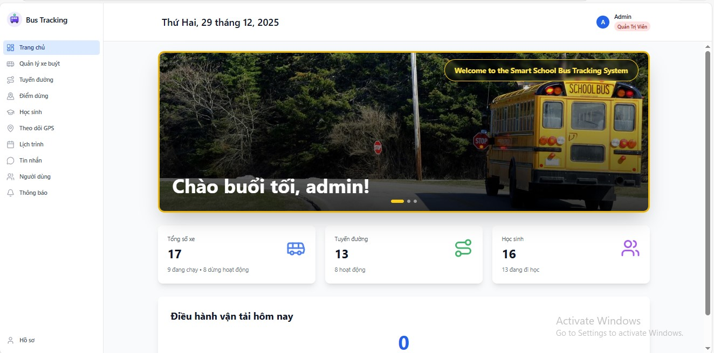
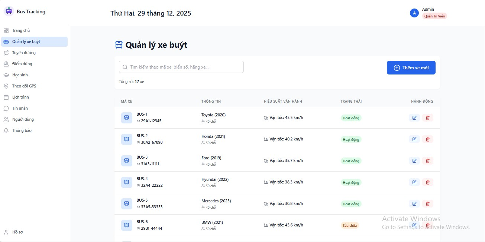
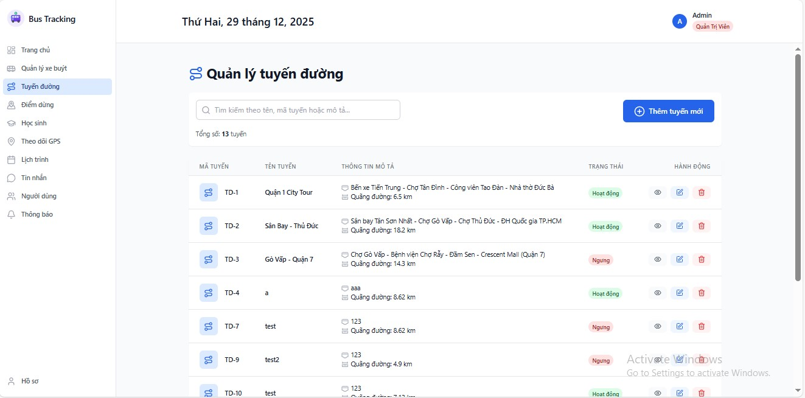
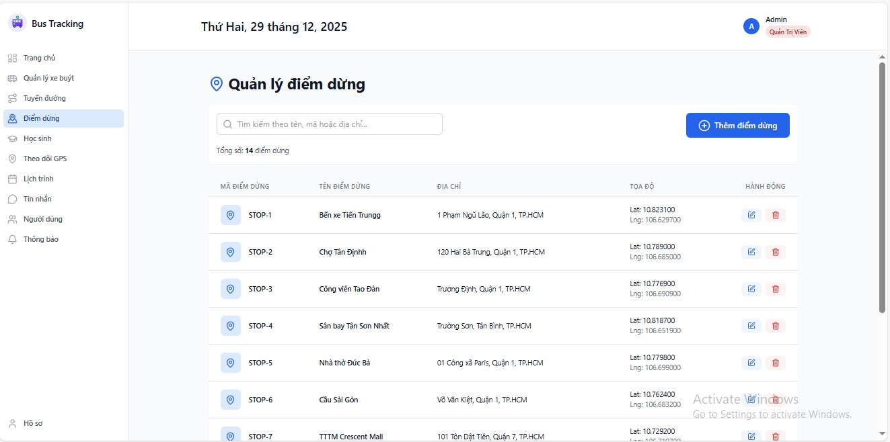
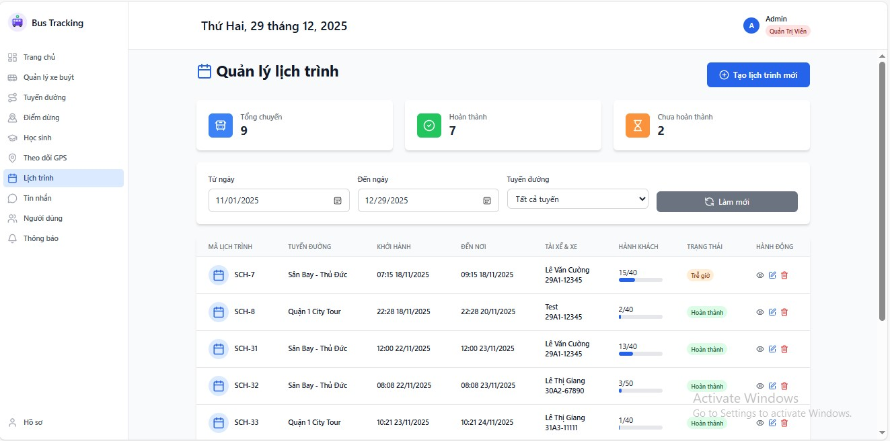
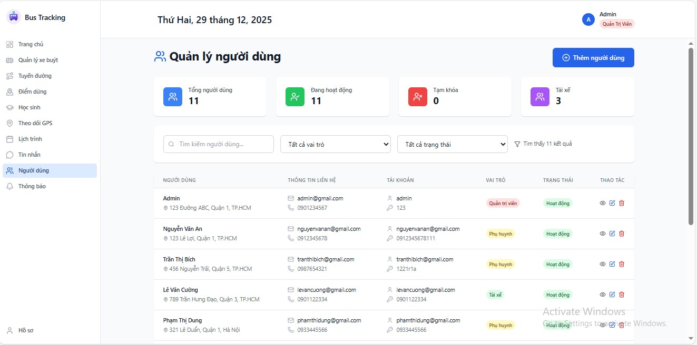
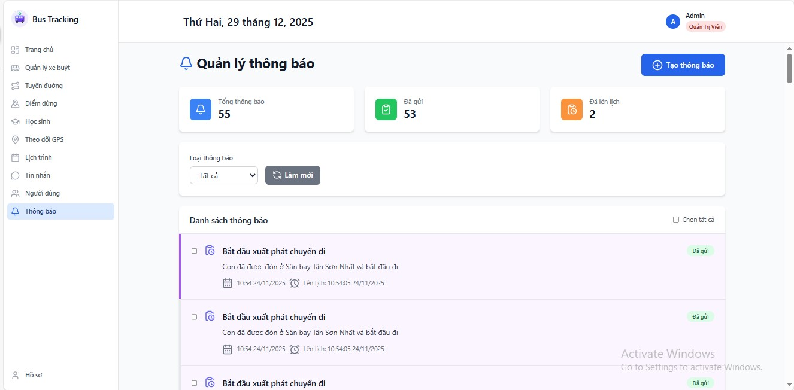

<!-- author: uncletientrung -->
# Đồ án môn Công nghệ phần mềm  
## Đề tài: Hệ thống theo dõi xe buýt 
<!-- ### Thành viên nhóm
 Nguyễn Tiến Trung (L) - 3123410396  <br>
 Nguyễn Minh Thuận - 3123410365  <br>
 Nguyễn Thái Vinh - 3123410433       <br>
 Phan Hoàng Vũ - 3123410436
 Đặng Nhật Đức - 3123410082 -->

## Thành viên & Đóng góp
| Thành viên | MSSV | Vai trò | Frontend | Backend | 
|-----------|------|--------|----------|
|  Nguyễn Tiến Trung | 3123410396 | Nhóm trưởng | 20% | 70% |
|  Nguyễn Minh Thuận | 3123410365 | Thành viên | 10% | 10% |
|  Nguyễn Thái Vinh | 3123410433 | Thành viên | 60% | 10% |
|  Phan Hoàng Vũ | 3123410436 | Thành viên | 10% | 10% |
|  Đặng Nhật Đức | 3123410082 | Thành viên | 0% | 0% |
**Lưu ý**: Nhóm thực hiện khoảng **30% khối lượng công việc ở Frontend**, 
có tham khảo và sử dụng **công cụ AI hỗ trợ** trong việc tra cứu tài liệu, gợi ý giải pháp và chỉnh sửa nội dung.

## Getting Started
1. Tải source code về:
    ```bash
   git clone https://github.com/uncletientrung/BusTrackingSystem_CNPM.git
   ```
2. Mở xampp và vào trang http://localhost/phpmyadmin/ tạo 1 database mới có tên là bustrackingsystem và import cơ sở dữ liệu trong folder frontend -> database -> file bustrackingsystem.sql trong source code.
3. Sử dụng Visual Studio Code để chạy chương trình
4. 4.1: Mở terminal -> cd frontend -> npm run dev
    4.2: Mở terminal mới -> cd backend -> npm start
5. Truy cập "http://localhost:5173/" để sử dụng chương trình

### Tài khoản Admin
- Username: admin
- Password: 123

### Giao diện
 
 
 <h4 align="center">Trang chủ</h4>

 
 
 <h4 align="center">Quản lý xe buýt</h4>

 
 
 <h4 align="center">Quản lý tuyến đường</h4>

 
 
 <h4 align="center">Quản lý điểm dừng</h4>

 
 
 <h4 align="center">Quản lý học sinh</h4>

 
 
 <h4 align="center">Theo dõi vị trí xe</h4>

 
 
 <h4 align="center">Quản lý lịch trình</h4>

 
 
 <h4 align="center">Nhắn tin với tài xế</h4>

 
 
 <h4 align="center">Quản lý người dùng</h4>

 
 
 <h4 align="center">Quản lý thông báo</h4>